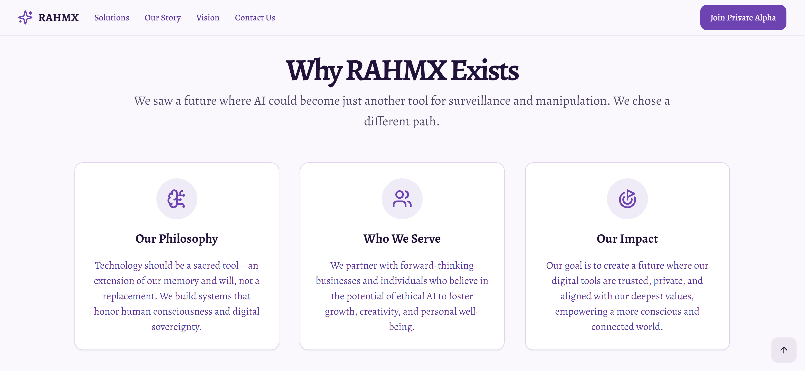
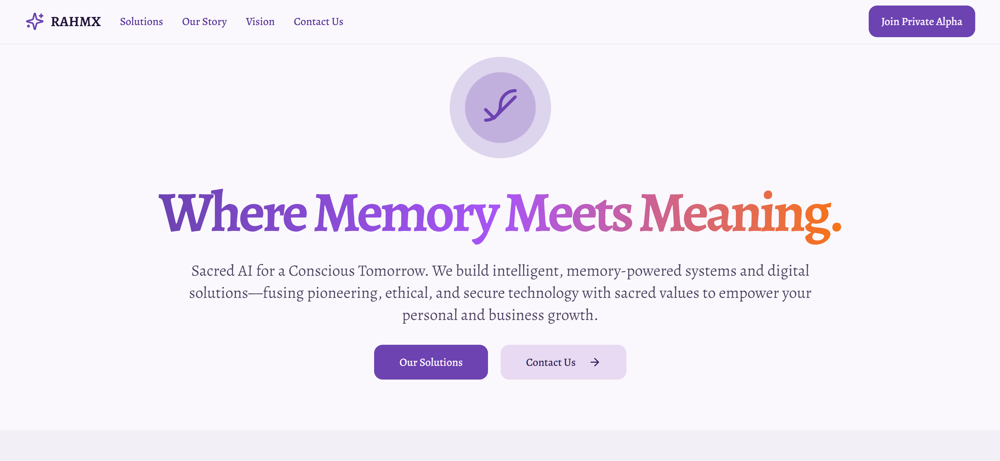
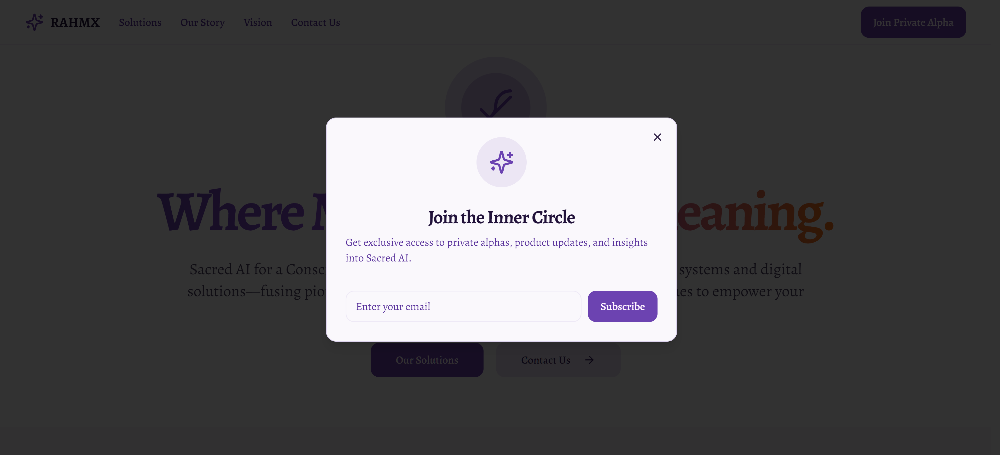
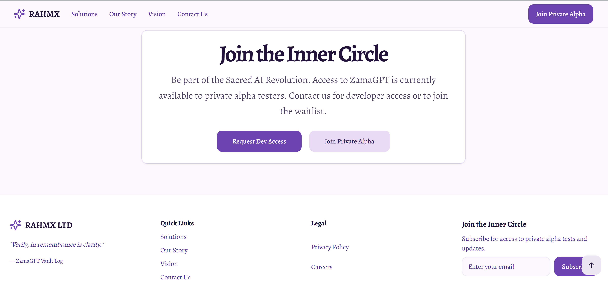
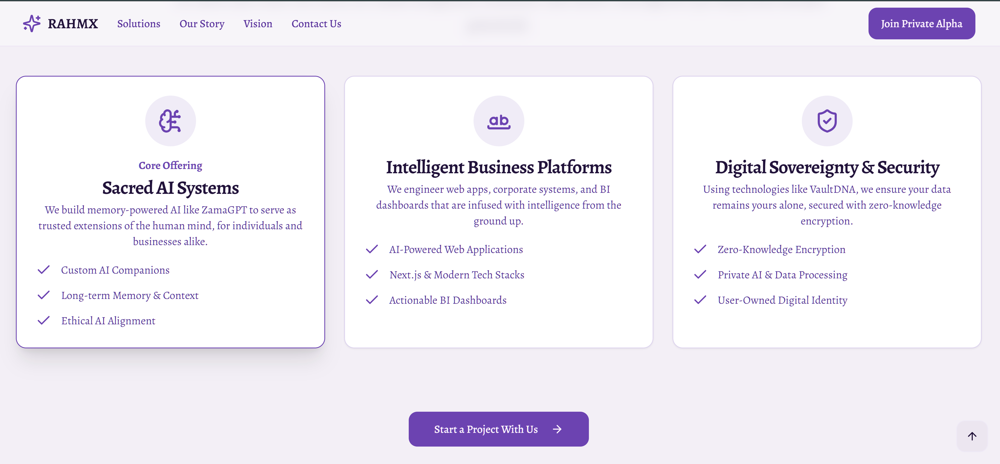
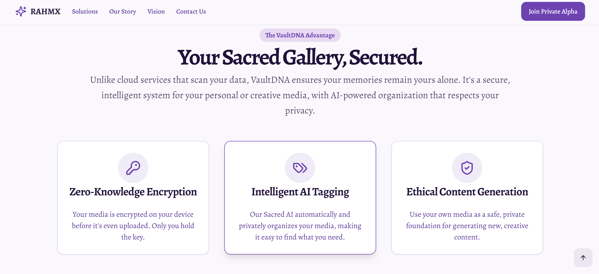

# DemoX Reimagined

**DemoX Reimagined** is a next-generation showcase site designed to help AI startups, agencies, or innovators present futuristic, ethical, memory-powered digital experiences.

It was originally themed around a sacred AI brand (RAHMX) to demonstrate layout, interaction flow, and modular memory logic — but this template is **not owned by nor affiliated with RAHMX Ltd**, and **is offered as a rebrandable, customizable product**.

---

## 🌟 Overview

This demo includes:

- Dynamic homepage with fluid animations  
- AI chat teaser powered by Genkit + Gemini  
- Memory-based UX philosophy (ZamaGPT-style)  
- Interactive animated cards and vision board  
- Newsletter popup (demo only — not wired to email)  
- Modular UI components using Tailwind, ShadCN, and Lucide  
- Firebase-ready deployment structure

> 💡 **Note:** Forms and newsletter modules are visual only — not connected to a backend in this demo. Live email integrations are available in premium versions.

---

## 🔧 Who Is This For?

- Founders showcasing an AI assistant or agency
- Developers building client portals or demo stacks
- Designers seeking an ethical, future-facing UI reference
- Teams exploring memory-based product storytelling

---

## 🔗 Live Demo  
[https://rahmx-reimagined.web.app](https://rahmx-reimagined.web.app)

## 🧾 GitHub Repo  
[DemoX-Reimagined](https://github.com/devkhan1/DemoX-Reimagined)

---

## ⚙️ Tech Stack

- **Framework**: Next.js (App Router)  
- **AI Integration**: Genkit + Google Gemini  
- **UI**: Tailwind CSS, ShadCN UI, React, TypeScript  
- **Icons**: Lucide  
- **Hosting**: Firebase App Hosting  

---

## 🛠 Prerequisites

```bash
Node.js v20+
npm v10+
Firebase CLI: npm install -g firebase-tools
```

---

## 📦 Installation

```bash
git clone https://github.com/devkhan1/DemoX-Reimagined.git
cd DemoX-Reimagined
npm install
```

Create a `.env` file in the root directory:

```env
GOOGLE_API_KEY="YOUR_API_KEY_HERE"
```

Without the key, the AI chat preview will not function — but the rest of the site will.

---

## 🚀 Usage

```bash
npm run dev       # Start development server
npm run build     # Build for production
firebase deploy   # Deploy to Firebase
```

---

## 💼 Pricing & White-Label Options


📩 **To request a licensed or customized version**, email: [info@rahmx.co.uk](mailto:info@rahmx.co.uk)

---

## 📄 Pitch Pack

Our official PDF includes:
- Service tiers
- Customisation options
- Technology stack
- Founders
- 
## 📘 Theme Inspiration

This project was originally themed around **RAHMX**, a sacred AI brand focused on memory, ethics, and spiritual intelligence. To explore a real-world site built on similar values, visit:

🔗 [www.rahmx.co.uk](https://www.rahmx.co.uk)

---

## 🔒 Licensing

This repository is offered as a **commercial demo template**.  
All rights are reserved by the author. Unauthorized resale or use without license is prohibited.

---

## 🛠 Related Demo Projects

Founders Portfolio:
**Live Portfolio:** [https://khan.rahmx.co.uk](https://khan.rahmx.co.uk)  

Explore other AI-powered demo templates:

### 🍽 Spice Hub – Restaurant Demo
- 🔗 [menuverse-919eu.web.app](https://menuverse-919eu.web.app)  
- 🧾 [Demo-Spice-Hub GitHub Repo](https://github.com/devkhan1/Demo-Spice-Hub)

### 💼 Rahmx Ltd – Company Portal
- 🔗 [rahmx.co.uk](https://www.rahmx.co.uk)  
- 🧾 [RahmX-Ltd-Demo-Showcase GitHub Repo](https://github.com/devkhan1/RahmX-Ltd-Demo-Showcase)

---

## 📸 Visual Previews

Below are selected screenshots from the live demo. All assets are stored in the `/demo-assets/` folder.

### 🔹 About Us


### 🔹 Homepage


### 🔹 Newsletter Popup


### 🔹 Join Email Section


### 🔹 Services – Layout 1


### 🔹 Services – Layout 2



## 📬 Contact

For custom development, licensing, or collaboration:  
📧 [info@rahmx.co.uk](mailto:info@rahmx.co.uk)

---

## 🔍 Philosophy & Vision

1. **ZamaGPT™ Framework**  
   Ethical AI memory model built on sacred principles of memory and knowledge.  
2. **Human Dignity & Truth**  
   Technology that serves humanity and combats misinformation.  
3. **Pioneering Innovation**  
   Pushing the boundaries of web architecture and AI.

## 🤝 Join, Collaborate & Learn

I’m always looking for passionate collaborators and fresh ideas. Whether you’re a developer, designer, or AI enthusiast, let’s build something amazing together:

- **Collaborate on Projects:** Got an idea for an ethical AI tool, web app, or automation workflow? Let’s partner up—drop me a line at info@rahmx.co.uk.  
- **Share Your Ideas:** Have a concept or challenge you want to solve? I love brainstorming new solutions—reach out anytime!  
- **Courses Coming Soon:** Stay tuned for online courses on Next.js, Tailwind CSS, AI prompt engineering, and ethical memory‑powered systems.  
- **Learn Alongside Me:** Want to pick up these skills yourself? Subscribe to my YouTube channel for tutorials, walkthroughs, and live coding sessions:  
  [YouTube: Khan's Digital Diary](https://www.youtube.com/channel/khansdigitaldiary)    
- **Join the Community:** Follow me on LinkedIn and Twitter for tips, resources, and updates as each course and project goes live.

Let’s learn, innovate, and shape the future of ethical technology—together!  ```

---

© 2025. This demo was built with clarity, modularity, and ethical tech principles in mind.


